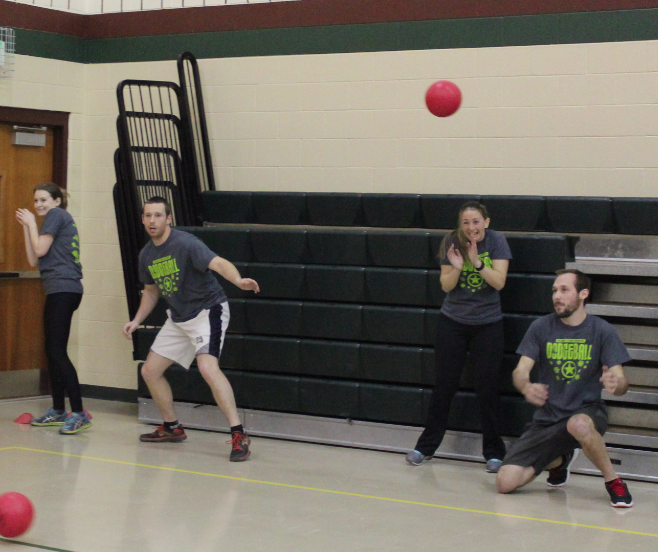

## Welcome to Audrey's Code Site
The goal of this site is to store a resume, code samples, photos, and to practice with github.

Audrey

- Bulleted
- List

1. Numbered
2. List

**Bold** and _Italic_ and `Code` text

[Link](url) and 
[my photo page](pictures.md)

[my JavaScript Game](miao.github.io/part4new.html)

# Audrey McGarry
### Computer Scientist, CEH, CISSP

## Profile
A creative and curious computer scientist who is looking to explore innovative positions related to software development, basic/applied research, information security, or data science. Enjoys learning new languages and skills. Excels at communicating and presenting complex ideas and concepts to technical and non-technical audiences.

## Skills
    	<ul>
    		<li> C++, CSS, Eclipse, HTML, Java, Javascript, Python, Perl, SQL, vi, Maple, MATLAB, R, Sublime </li>
    		<li> CENTOS, Ubuntu, Kali, Windows </li>
    		<li> LaTeX, Microsoft Office, Sharepoint, VMware </li>
    	</ul>

    	<ul>
    		<li>Creativity</li>
    		<li>Critical Thinking</li>
    		<li>Learning</li>
    		<li>Strategy</li>
    	</ul>

## Education
	    	
 MASTER OF SCIENCE
			COMPUTER SCIENCE
			University of California Irvine, CA
			2009-2011 / GPA 3.5 
   
			

			BACHELOR OF ARTS
			MATHEMATICS
			Wartburg College, IA
			2005-2009 / GPA 3.6
			

## Experience
### Transamerica / Baltimore, MD / 2015 – Present
### Information Systems Security Analyst
			•	Test and develop mail and web egress rules. Monitor, address, and educate users on policy and rule violations.
			•	Create and update internal Sharepoint site to facilitate and collect information for disaster recovery exercises.
			•	Streamlined metrics collection and aggregation in Excel for data loss prevention program. Provided thorough documentation, meaningful data summaries, and data interpretation from IronPort proxies.

### US Army / Aberdeen Proving Ground, MD / 2012 - 2015 
### Computer Scientist
			•	Used supervised machine learning to analyze and assess the effectiveness of sensors and countermeasures
			•	Lead basic research by creating algorithms to compress and extract transformed malware 
			•	Supported the development of a secure-dynamic-networking program 
			•	Managed the development of a vulnerability scanning tool
			•	Performed blue team testing and vulnerability evaluations for Army units

### US Army / Ft. Monmouth, NJ / Summer 2010 
### Intern Computer Scientist
			•	Performed system hardening of Windows and Linux machines
			•	Evaluated Smartphones for Army network certification and accreditation
			•	Created a usability study to understand end-user perceptions of security
 			

## Professional Certifications
	 		
 CISSP - Certified Information    	Systems Security Professional
			CEH - Certified Ethical Hacker
			Society of Actuaries Exam P
			

    </body>

 </html>
